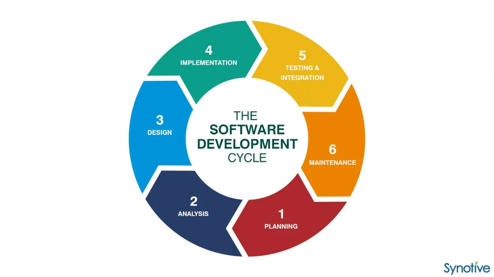

# Software Development Life Cycle (SDLC) phases

Software life cycle models describe phases of the software cycle and the order in which those phases are executed. Each phase produces deliverables required by the next phase in the life cycle. Requirements are translated into design. Code is produced according to the design which is called development phase. After coding and development the testing verifies the deliverable of the implementation phase against requirements. The testing team follows Software Testing Life Cycle (STLC) which is similar to the development cycle followed by the development team.

There are following six phases in every Software development life cycle model:

1) Requirement gathering and analysis: Business requirements are gathered in this phase. This phase is the main focus of the project managers and stake holders. Meetings with managers, stake holders and users are held in order to determine the requirements like; Who is going to use the system? How will they use the system? What data should be input into the system? What data should be output by the system? These are general questions that get answered during a requirements gathering phase. After requirement gathering these requirements are analyzed for their validity and the possibility of incorporating the requirements in the system to be development is also studied.

Finally, a Requirement Specification document is created which serves the purpose of guideline for the next phase of the model. The testing team follows the Software Testing Life Cycle and starts the Test Planning phase after the requirements analysis is completed.

2) Design: In this phase the system and software design is prepared from the requirement specifications which were studied in the first phase. System Design helps in specifying hardware and system requirements and also helps in defining overall system architecture. The system design specifications serve as input for the next phase of the model.

In this phase the testers comes up with the Test strategy, where they mention what to test, how to test.

3) Implementation / Coding: On receiving system design documents, the work is divided in modules/units and actual coding is started. Since, in this phase the code is produced so it is the main focus for the developer. This is the longest phase of the software development life cycle.

4) Testing: After the code is developed it is tested against the requirements to make sure that the product is actually solving the needs addressed and gathered during the requirements phase. During this phase all types of functional testing like unit testing, integration testing, system testing, acceptance testing are done as well as non-functional testing are also done.

5) Deployment: After successful testing the product is delivered / deployed to the customer for their use.

As soon as the product is given to the customers they will first do the beta testing. If any changes are required or if any bugs are caught, then they will report it to the engineering team. Once those changes are made or the bugs are fixed then the final deployment will happen.

6) Maintenance: Once when the customers starts using the developed system then the actual problems comes up and needs to be solved from time to time. This process where the care is taken for the developed product is known as maintenance.

**Bibliography**:
- https://medium.com/@jilvanpinheiro/software-development-life-cycle-sdlc-phases-40d46afbe384