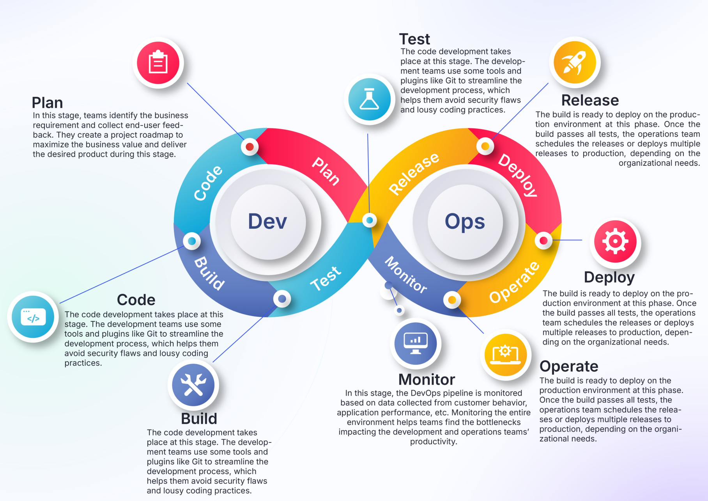
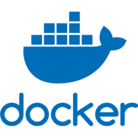

# DevOps tips and best practices

This repository is a collection of essential tips, troubleshooting guides, and best practices for DevOps engineers. Whether you're working with Docker, Kubernetes, GitHub CI/CD, or Linux, this repo provides valuable insights to help streamline your workflow and enhance your productivity.

## DevOps Essentials

  

- https://sysxplore.com/
- https://twitter.com/sysxplore/status/1831934837730767250

## Docker

Explore best practices, troubleshooting techniques, and detailed Dockerfile instructions to optimize your containerized applications.

- [Docker Troubleshooting](./docker/docker_troubleshooting.md)
- [Best Practices](./docker/docker_best_practices.md)
- [Dockerfile Instructions](./docker/dockerfile_instructions.md)
- [Securing Docker Containers](./docker/docker_security.md)
- [Docker Monitoring](./docker/docker_monitoring.md)
- [Docker Performance Tuning](./docker/docker_performance.md)

## Kubernetes

Gain insights into best practices for Kubernetes, along with troubleshooting tips to handle deployment issues effectively.

#### Troubleshooting
- [General Kubernetes Troubleshooting Steps](./kubernetes/general_troubleshooting.md)
  - [Troubleshoot a deployment](./kubernetes/troubleshooting_deployments.md)

#### Components
- [Kubernetes Components](./kubernetes/kubernetes_components.md)
- [Kubernetes Cheat Sheet](./kubernetes/kubernetes_cheat_sheet.md)

#### Security
- [Kubernetes Security Best Practices](./kubernetes/kubernetes_security.md)

#### Observability
- [Kubernetes Logging](./kubernetes/kubernetes_logging.md)

#### Networking
- [How a DNS Works](./networking/how_dns_works.md)
- [Kubernetes Networking](./kubernetes/kubernetes_networking.md)
- [TCP/UPD](./networking/tcp_udp.md)

#### Misc
- [Best Practices](./kubernetes/best_practices.md)
- [Kubernetes Plugins Resources](./kubernetes/kubernetes_resources.md)
- [Kubernetes Performance Optimization](./kubernetes/kubernetes_performance.md)

## Github CI/CD

Learn how to implement continuous integration and continuous deployment (CI/CD) workflows using GitHub Actions.

- [Git Commands](./github/git_commands.md)
- [CI/CD](./github/cicd.md)
  - [Sample Python Pipeline](./github/ci_pipeline_python.md)
  - [Sample Typescript Pipeline](/github/ci_pipeline_typescript.md)
- [CI/CD Security](./github/cicd_security.md)

## Linux

Discover a range of useful Linux commands that can help improve your efficiency and effectiveness on the command line.

- [Useful commands](./linux/useful_commands.md)

## Infrastructure as Code (IaC)

Best practices and tips for managing infrastructure using code.

  - [Terraform Best Practices](./iac/terraform_best_practices.md)
  - [Ansible Playbooks](./iac/ansible_playbooks.md)
  - [Ansible Command Line](./iac/ansible_command_line.md)
  - [Jenkins Best Practices](./iac/jenkins_best_practices.md)

## Misc

- [SDLC](./AWS/sdlc.md)
- [Devops and Cloud Certifications](./misc/devops_cloud_certifications.md)

----
----

  
  
  
  
  
  

----
----

By @radicaled42