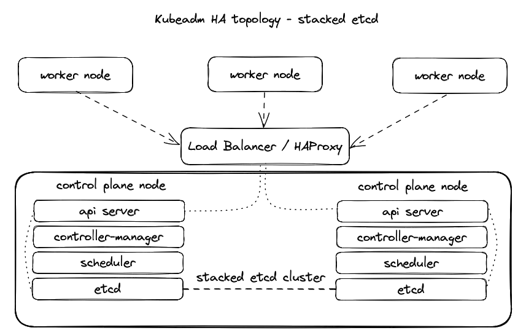

# Kubernetes Multi-Master Node Cluster

<p aling="center">
  
</p>

## Kubernetes Master Node Components

**Kube-apiserver**:

    Provides an API that serves as the front end of a Kubernetes control plane.
    It handles external and internal requests that determine whether a request is valid and then processes it.
    The API can be accessed via the kubectl command-line interface or other tools like kubeadm, and via REST calls.

**Kube-scheduler**:

    This component schedules pods on specific nodes as per automated workflows and user-defined conditions.

**Kube-controller-manager**:

    The Kubernetes controller manager is a control loop that monitors and regulates the state of a Kubernetes cluster.
    It receives information about the current state of the cluster and objects within it and sends instructions to move the cluster towards the cluster operator’s desired state.

**etcd**:

    A key-value database that contains data about your cluster state and configuration.
    Etcd is fault-tolerant and distributed.

## Kubernetes Worker Node Components

**Kubelet**:

    Each node contains a kubelet, which is a small application that can communicate with the Kubernetes control plane.
    The kubelet ensures that containers specified in pod configuration run on a specific node, and manage their lifecycle.
    It executes the actions commanded by your control plane.

**Kube-proxy**:

    All compute nodes contain kube-proxy, a network proxy that facilitates Kubernetes networking services.
    It handles all network communications outside and inside the cluster, and forwards traffic or replies on the packet filtering layer of the operating system.

**Pods**:

    A pod serves as a single application instance and is considered the smallest unit in the object model of Kubernetes.

**Bastion Host**:

    The computer generally hosts a single application or process, for example, a proxy server or load balancer, and all other services are removed or limited to reduce the threat to the computer.

## How to create an HA Cluster

I used these servers:
    * k8s-haproxy on IP: 192.168.1.116
    * k8s-master-node-01 on IP: 192.168.1.112
    * k8s-master-node-02 on IP: 192.168.1.123

### Set up client tools on the HAProxy machine.

#### Installing cfssl

CFSSL is an SSL tool by Cloudflare that lets us create our Certs and CAs.

1. Download the binaries

```bash
k8s-user@k8s-haproxy:~$ wget https://pkg.cfssl.org/R1.2/cfssl_linux-amd64
k8s-user@k8s-haproxy:~$ wget https://pkg.cfssl.org/R1.2/cfssljson_linux-amd64
```

2. Add the execution permission to the binaries

`k8s-user@k8s-haproxy:~$ chmod +x cfssl*`

3. Move the binaries to /usr/local/bin
   
```bash
k8s-user@k8s-haproxy:~$ sudo mv cfssl_linux-amd64 /usr/local/bin/cfssl
k8s-user@k8s-haproxy:~$ sudo mv cfssljson_linux-amd64 /usr/local/bin/cfssljson
```

4. Verify the installation

`k8s-user@k8s-haproxy:~$ cfssl version`

#### Installing kubectl

1. Get the binary

`k8s-user@k8s-haproxy:~$ curl -LO https://storage.googleapis.com/kubernetes-release/release/v1.19.0/bin/linux/amd64/kubectl`

2. Add the execution permission to the binary

`k8s-user@k8s-haproxy:~$ chmod +x kubectl`

3. Move the binary to /usr/local/bin

`k8s-user@k8s-haproxy:~$ sudo mv kubectl /usr/local/bin`

#### Installing HAProxy Load Balancer

Since I will be deploying 2 Kubernetes master nodes, I need to deploy a HAProxy Load Balancer in front of them to distribute the traffic.

1. Install HAProxy

`k8s-user@k8s-haproxy:~$ sudo apt-get install -y haproxy`

2. Configure HAProxy

`k8s-user@k8s-haproxy:~$ sudo nano /etc/haproxy/haproxy.cfg`
   
```
#Enter the following config: to /etc/haproxy/haproxy.cfg

global
...
default
...
frontend kubernetes
bind 192.168.1.116:6443
option tcplog
mode tcp
default_backend kubernetes-master-nodes

backend kubernetes-master-nodes
mode tcp
balance roundrobin
option tcp-check
server k8s-master-node-01 192.168.1.112:6443 check fall 3 rise 2
server k8s-master-node-02 192.168.1.123:6443 check fall 3 rise 2
```

3. Restart HAProxy

`k8s-user@k8s-haproxy:~$ sudo systemctl restart haproxy`

#### Generating the TLS certificates

##### Creating a Certificate Authority

1. Create the certificate authority configuration file

`k8s-user@k8s-haproxy:~$ nano ca-config.json`

```json
{
  "signing": {
    "default": {
      "expiry": "8760h"
    },
    "profiles": {
      "kubernetes": {
        "usages": ["signing", "key encipherment", "server auth", "client auth"],
        "expiry": "8760h"
      }
    }
  }
}
```

2. Create the certificate authority signing request configuration file

`k8s-user@k8s-haproxy:~$ nano ca-csr.json`

```json
{
  "CN": "Kubernetes",
  "key": {
    "algo": "rsa",
    "size": 2048
  },
  "names": [
  {
    "C": "SK",
    "L": "Bratislava",
    "O": "XYZ",
    "OU": "IT",
    "ST": "Slovakia"
  }
 ]
}
```

3. Generate the certificate authority certificate and private key

`k8s-user@k8s-haproxy:~$ cfssl gencert -initca ca-csr.json | cfssljson -bare ca`

4. Verify that the ca-key.pem and the ca.pem were generated

`k8s-user@k8s-haproxy:~$ ls -la`

##### Creating the certificate for the Etcd cluster

1. Create the certificate signing request configuration file

`k8s-user@k8s-haproxy:~$ nano kubernetes-csr.json`

```json
{
  "CN": "Kubernetes",
  "key": {
    "algo": "rsa",
    "size": 2048
  },
  "names": [
  {
    "C": "SK",
    "L": "Bratislava",
    "O": "XYZ",
    "OU": "IT",
    "ST": "Slovakia"
  }
 ]
}
```

3. Generate the certificate and private key

```bash
k8s-user@k8s-haproxy:~$ cfssl gencert \
-ca=ca.pem \
-ca-key=ca-key.pem \
-config=ca-config.json \
-hostname=192.168.1.116,192.168.1.112,192.168.1.123,127.0.0.1,kubernetes.default \
-profile=kubernetes kubernetes-csr.json | \
cfssljson -bare kubernetes
```

4. Verify that the kubernetes-key.pem and the kubernetes.pem file were generated

`k8s-user@k8s-haproxy:~$ ls -la`

4. Copy the certificate to each node

```
scp ca.pem kubernetes.pem kubernetes-key.pem k8s-user@192.168.1.112:~
scp ca.pem kubernetes.pem kubernetes-key.pem k8s-user@192.168.1.123:~
```

### Preparing the nodes for kubeadm

Initial Setup for all master and node machines

1. Copy the commands below and paste them into a setup.sh file and then execute it with . setup.sh.

```
k8s-user@k8s-master-node-01:~$ sudo nano setup.sh
k8s-user@k8s-master-node-02:~$ sudo nano setup.sh

k8s-user@k8s-master-node-01:~$ . setup.sh
k8s-user@k8s-master-node-02:~$ . setup.sh
```

```
sudo apt-get remove docker docker-engine docker.io containerd runc

sudo apt-get install -y \
    apt-transport-https \
    ca-certificates \
    curl \
    gnupg-agent \
    software-properties-common

curl -fsSL https://download.docker.com/linux/ubuntu/gpg | sudo apt-key add -

sudo add-apt-repository \
   "deb [arch=amd64] https://download.docker.com/linux/ubuntu \
   $(lsb_release -cs) \
   stable"

sudo apt-get install -y docker-ce docker-ce-cli containerd.io

sudo usermod -aG docker k8s-user

curl -s https://packages.cloud.google.com/apt/doc/apt-key.gpg | sudo apt-key add -
cat <<EOF | sudo tee /etc/apt/sources.list.d/kubernetes.list
deb https://apt.kubernetes.io/ kubernetes-xenial main
EOF
sudo apt-get update
sudo apt-get install -y kubelet kubeadm kubectl
sudo apt-mark hold kubelet kubeadm kubectl

sudo swapoff -a
```

### Installing and configuring Etcd on all 2 Master Nodes

1. Download and move etcd files and certs to their respective places

```
k8s-user@k8s-master-node-01:~$ sudo mkdir /etc/etcd /var/lib/etcd

k8s-user@k8s-master-node-02:~$ sudo mkdir /etc/etcd /var/lib/etcd

k8s-user@k8s-master-node-01:~$ sudo mv ~/ca.pem ~/kubernetes.pem ~/kubernetes-key.pem /etc/etcd

k8s-user@k8s-master-node-02:~$ sudo mv ~/ca.pem ~/kubernetes.pem ~/kubernetes-key.pem /etc/etcd

k8s-user@k8s-master-node-01:~$ wget https://github.com/etcd-io/etcd/releases/download/v3.4.13/etcd-v3.4.13-linux-amd64.tar.gz

k8s-user@k8s-master-node-02:~$ wget https://github.com/etcd-io/etcd/releases/download/v3.4.13/etcd-v3.4.13-linux-amd64.tar.gz

k8s-user@k8s-master-node-01:~$ tar xvzf etcd-v3.4.13-linux-amd64.tar.gz

k8s-user@k8s-master-node-02:~$ tar xvzf etcd-v3.4.13-linux-amd64.tar.gz

k8s-user@k8s-master-node-01:~$ sudo mv etcd-v3.4.13-linux-amd64/etcd* /usr/local/bin/

k8s-user@k8s-master-node-02:~$ sudo mv etcd-v3.4.13-linux-amd64/etcd* /usr/local/bin/
```

2. Create an etcd systemd unit file

```
k8s-user@k8s-master-node-01:~$ sudo nano /etc/systemd/system/etcd.service
k8s-user@k8s-master-node-02:~$ sudo nano /etc/systemd/system/etcd.service
```

```
[Unit]
Description=etcd
Documentation=https://github.com/coreos

[Service]
ExecStart=/usr/local/bin/etcd \
  --name 192.168.1.112 \
  --cert-file=/etc/etcd/kubernetes.pem \
  --key-file=/etc/etcd/kubernetes-key.pem \
  --peer-cert-file=/etc/etcd/kubernetes.pem \
  --peer-key-file=/etc/etcd/kubernetes-key.pem \
  --trusted-ca-file=/etc/etcd/ca.pem \
  --peer-trusted-ca-file=/etc/etcd/ca.pem \
  --peer-client-cert-auth \
  --client-cert-auth \
  --initial-advertise-peer-urls https://192.168.1.112:2380 \
  --listen-peer-urls https://192.168.1.112:2380 \
  --listen-client-urls https://192.168.1.112:2379,http://127.0.0.1:2379 \
  --advertise-client-urls https://192.168.1.112:2379 \
  --initial-cluster-token etcd-cluster-0 \
  --initial-cluster 192.168.1.112=https://192.168.1.112:2380,192.168.1.123=https://192.168.1.123:2380 \
  --initial-cluster-state new \
  --data-dir=/var/lib/etcd
Restart=on-failure
RestartSec=5

[Install]
WantedBy=multi-user.target
```

Replace the IP address on all fields except the — initial-cluster field to match the machine IP.

3. Reload the daemon configuration

```
k8s-user@k8s-master-node-01:~$ sudo systemctl daemon-reload
k8s-user@k8s-master-node-02:~$ sudo systemctl daemon-reload
```

4. Enable etcd to start at boot time

```
k8s-user@k8s-master-node-01:~$ sudo systemctl enable etcd
k8s-user@k8s-master-node-02:~$ sudo systemctl enable etcd
```

5. Start etcd

```
k8s-user@k8s-master-node-01:~$ sudo systemctl start etcd
k8s-user@k8s-master-node-02:~$ sudo systemctl start etcd
```

6. Verify that the cluster is up and running

```
k8s-user@k8s-master-node-01:~$ ETCDCTL_API=3 etcdctl member list

1ec9f10bf28faf68, started, 192.168.1.112, https://192.168.1.112:2380, https://192.168.1.112:2379, false

7a9a899a0680e6b2, started, 192.168.1.123, https://192.168.1.123:2380, https://192.168.1.123:2379, false


k8s-user@k8s-master-node-02:~$ ETCDCTL_API=3 etcdctl member list

1ec9f10bf28faf68, started, 192.168.1.112, https://192.168.1.112:2380, https://192.168.1.112:2379, false

7a9a899a0680e6b2, started, 192.168.1.123, https://192.168.1.123:2380, https://192.168.1.123:2379, false
```

### Initialising the Master Nodes

#### Initialising the first Master Node

1. Create the configuration file for kubeadm

`k8s-user@k8s-master-node-01:~$ nano config.yaml`

```
apiVersion: kubeadm.k8s.io/v1beta3
kind: ClusterConfiguration
kubernetesVersion: v1.28.0
controlPlaneEndpoint: "192.168.1.116:6443"
etcd:
  external:
    endpoints:
      - https://192.168.1.112:2379
      - https://192.168.1.123:2379
    caFile: /etc/etcd/ca.pem
    certFile: /etc/etcd/kubernetes.pem
    keyFile: /etc/etcd/kubernetes-key.pem
networking:
  podSubnet: 10.30.0.0/24
apiServer:
  certSANs:
    - "192.168.1.116"
  extraArgs:
    apiserver-count: "3"
```

Add any additional domains or IP Addresses that you would want to connect to the cluster under certSANs.

2. Initialise the machine as a master node

`k8s-user@k8s-master-node-01:~$ sudo kubeadm init --config=config.yaml`

3. Copy the certificates to the second master node

`k8s-user@k8s-master-node-01:~$ sudo scp -r /etc/kubernetes/pki k8s-user@192.168.1.123:~`

#### Initialising the second Master Node

1. Remove the apiserver.crt and apiserver.key

`k8s-user@k8s-master-node-02:~$ rm ~/pki/apiserver.*`

2. Move the certificates to the /etc/kubernetes directory

`k8s-user@k8s-master-node-02:~$ sudo mv ~/pki /etc/kubernetes/`

3. Create the configuration file for kubeadm

`k8s-user@k8s-master-node-02:~$ nano config.yaml`

```
apiVersion: kubeadm.k8s.io/v1beta3
kind: ClusterConfiguration
kubernetesVersion: v1.28.0
controlPlaneEndpoint: "192.168.1.116:6443"
etcd:
  external:
    endpoints:
      - https://192.168.1.112:2379
      - https://192.168.1.123:2379
    caFile: /etc/etcd/ca.pem
    certFile: /etc/etcd/kubernetes.pem
    keyFile: /etc/etcd/kubernetes-key.pem
networking:
  podSubnet: 10.30.0.0/24
apiServer:
  certSANs:
    - "192.168.1.116"
  extraArgs:
    apiserver-count: "3"
```

4. Initialise the machine as a master node

`k8s-user@k8s-master-node-02:~$ sudo kubeadm init --config=config.yaml`

**Save the join command** printed in the output after the above command (Example)

```
You can now join any number of control-plane nodes by copying certificate authorities
and service account keys on each node and then running the following as root:

sudo kubeadm join 192.168.1.116:6443 --token aksywy.on2927krgaf9hja1 \
 --discovery-token-ca-cert-hash sha256:d4b9bbd0e92ba973ffc22401cd537298961f5a05ed1c6094336116f3b44a9730 \
 --control-plane

Then you can join any number of worker nodes by running the following on each as root:

sudo kubeadm join 192.168.1.116:6443 --token aksywy.on2927krgaf9hja1 \
 --discovery-token-ca-cert-hash sha256:d4b9bbd0e92ba973ffc22401cd537298961f5a05ed1c6094336116f3b44a9730
```

### Configure kubectl on the client machine

1. SSH to one of the master node

`k8s-user@k8s-haproxy:~$ ssh k8s-user@192.168.1.112`

2. Add permissions to the admin.conf file

`k8s-user@k8s-master-node-01:~$ sudo chmod +r /etc/kubernetes/admin.conf`

3. From the client machine, copy the configuration file

`k8s-user@k8s-master-node-01:~$ scp k8s-user@192.168.1.112:/etc/kubernetes/admin.conf .`

4. Create and configure the kubectl configuration directory

```
k8s-user@k8s-haproxy:/etc/kubernetes$ mv admin.conf ~/.kube/config
k8s-user@k8s-haproxy:/etc/kubernetes$ sudo mv admin.conf ~/.kube/config
k8s-user@k8s-haproxy:/etc/kubernetes$ sudo chmod 600 ~/.kube/config
```

5. Go back to the SSH session and revert the permissions of the config file

`k8s-user@k8s-master-node-01:~$ sudo chmod 600 /etc/kubernetes/admin.conf`

6. Test to see if you can access the Kubernetes API from the client machine

```
k8s-user@k8s-haproxy:~$ kubectl cluster-info

Kubernetes control plane is running at https://192.168.1.116:6443
CoreDNS is running at https://192.168.1.116:6443/api/v1/namespaces/kube-system/services/kube-dns:dns/proxy

To further debug and diagnose cluster problems, use 'kubectl cluster-info dump'.
```

```
k8s-user@k8s-haproxy:~$ kubectl get nodes

NAME                 STATUS     ROLES           AGE   VERSION
k8s-master-node-01   NotReady   control-plane   92m   v1.28.2
k8s-master-node-02   NotReady   control-plane   84m   v1.28.2
```

```
k8s-user@k8s-haproxy:~$ kubectl get pods -n kube-system

NAME                                         READY   STATUS    RESTARTS      
coredns-5dd5756b68-j7n7x                     0/1     Pending   0             
coredns-5dd5756b68-nmfmv                     0/1     Pending   0             
kube-apiserver-k8s-master-node-01            1/1     Running   1 (46m ago)   
kube-apiserver-k8s-master-node-02            1/1     Running   2 (46m ago)   
kube-controller-manager-k8s-master-node-01   1/1     Running   1 (46m ago)   
kube-controller-manager-k8s-master-node-02   1/1     Running   2 (46m ago)   
kube-proxy-75zgk                             1/1     Running   1 (46m ago)   
kube-proxy-m89j9                             1/1     Running   1 (46m ago)   
kube-scheduler-k8s-master-node-01            1/1     Running   1 (46m ago)   
kube-scheduler-k8s-master-node-02            1/1     Running   1 (46m ago)
```

### Deploying the overlay network

We will be using Project Calico as the overlay network.

1. Apply the manifest to deploy calico overlay

```
k8s-user@k8s-master-node-01:~$ curl https://docs.projectcalico.org/manifests/calico.yaml -O
kubectl apply -f calico.yaml
```

```
k8s-user@k8s-haproxy:~$ kubectl get nodes

NAME                 STATUS   ROLES           AGE    VERSION
k8s-master-node-01   Ready    control-plane   136m   v1.28.2
k8s-master-node-02   Ready    control-plane   128m   v1.28.2
```

```
k8s-user@k8s-master-node-01:~$ kubectl get pod -n kube-system -w

NAME                                         READY   STATUS    RESTARTS      
calico-kube-controllers-57758d645c-mhnkj     1/1     Running   0             
calico-node-fzx64                            1/1     Running   0             
calico-node-qj2hk                            1/1     Running   0             
coredns-5dd5756b68-j7n7x                     1/1     Running   0             
coredns-5dd5756b68-nmfmv                     1/1     Running   0             
kube-apiserver-k8s-master-node-01            1/1     Running   1 (87m ago)   
kube-apiserver-k8s-master-node-02            1/1     Running   2 (88m ago)   
kube-controller-manager-k8s-master-node-01   1/1     Running   1 (87m ago)   
kube-controller-manager-k8s-master-node-02   1/1     Running   2 (88m ago)   
kube-proxy-75zgk                             1/1     Running   1 (87m ago)   
kube-proxy-m89j9                             1/1     Running   1 (88m ago)   
kube-scheduler-k8s-master-node-01            1/1     Running   1 (87m ago)   
kube-scheduler-k8s-master-node-02            1/1     Running   1 (88m ago)

```

### Initialise the worker nodes

SSH into each worker node and execute the kubeadm join command that you copied previously.

```
sudo kubeadm join 192.168.1.116:6443 --token aksywy.on2927krgaf9hja1 \
 --discovery-token-ca-cert-hash sha256:d4b9bbd0e92ba973ffc22401cd537298961f5a05ed1c6094336116f3b44a9730
```

Once all worker nodes have joined the cluster, test the API to check the available nodes from the client machine.

- https://medium.com/@lubomir-tobek/kubernetes-multi-master-node-cluster-f2081e504983#