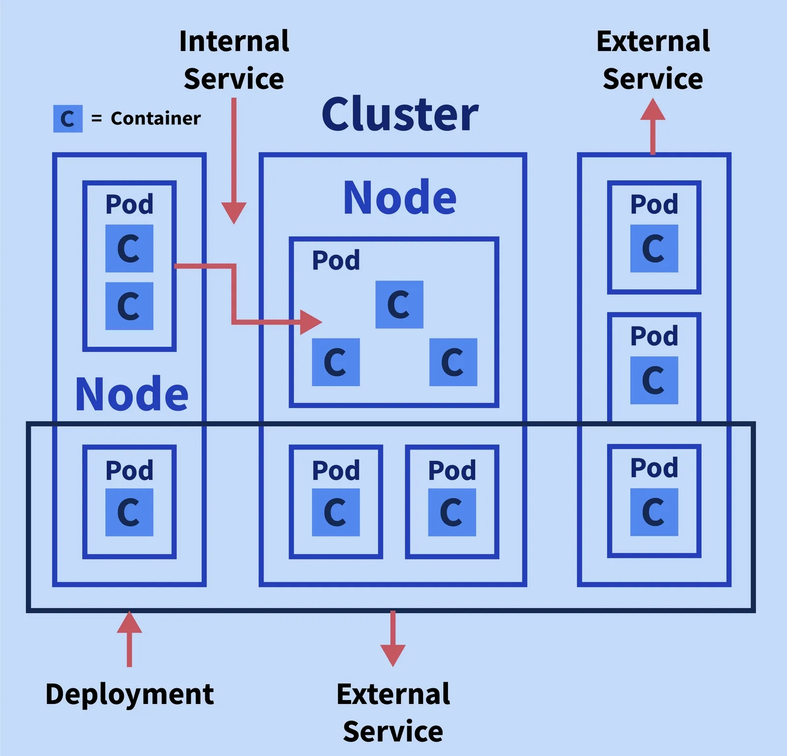

# Kubernetes Cheat Sheet

  

## Kubernetes Terminology

Terms that you should be familiar with before starting off with Kubernetes are enlisted below:

| Terms   | Explanation                                                                                                                                                                                                                                  |
| ------- | -------------------------------------------------------------------------------------------------------------------------------------------------------------------------------------------------------------------------------------------- |
| Cluster | It can be thought of as a group of physical or virtual servers where Kubernetes is installed.                                                                                                                                                |
| Nodes   | There are two types of Nodes,      Master node is a physical or virtual server that is used to control the Kubernetes cluster.     Worker node is the physical or virtual server where workload runs in given container technology. |
| Pods    | The group of containers that shares the same network namespaces.                                                                                                                                                                             |
| Labels  | These are the key-value pairs defined by the user and associated with Pods.                                                                                                                                                                  |
| Master  | It controls plane components to provide access points for admins to manage the cluster workloads.                                                                                                                                            |
| Service | It can be viewed as an abstraction that serves as a proxy for a group of Pods performing a "service".                                                                                                                                        |

Since now we have a fair understanding of what Kubernetes is, let's now jump to the cheat sheet.

## Kubernetes Commands

### Viewing Resource Information

1. Nodes: 

`ShortCode = no`

A Node is a worker machine in Kubernetes and may be either a virtual or a physical machine, depending on the cluster. Each Node is managed by the control plane. A Node can have multiple pods, and the Kubernetes control plane automatically handles scheduling the pods across the Nodes in the cluster.

| Commands                                      | Description                                                |
| --------------------------------------------- | ---------------------------------------------------------- |
| kubectl get node                              | To list down all worker nodes.                             |
| kubectl delete node <node_name>               | Delete the given node in cluster.                          |
| kubectl top node                              | Show metrics for a given node.                             |
| kubectl describe nodes \| grep ALLOCATED -A 5 | Describe all the nodes in verbose.                         |
| kubectl get pods -o wide \| grep <node_name>  | List all pods in the current namespace, with more details. |
| kubectl get no -o wide                        | List all the nodes with mode details.                      |
| kubectl describe no                           | Describe the given node in verbose.                        |
| kubectl annotate node <node_name>             | Add an annotation for the given node.                      |
| kubectl uncordon node <node_name>             | Mark my-node as schedulable.                               |
| kubectl label node                            | Add a label to given node                                  |

2. Pods

`Shortcode = po`

Pods are the smallest deployable units of computing that you can create and manage in Kubernetes.

| Commands                                      | Description                                          |
| --------------------------------------------- | ---------------------------------------------------- |
| kubectl get po                                | To list the available pods in the default namespace. |
| kubectl describe pod <pod_name>               | To list the detailed description of pod.             |
| kubectl delete pod <pod_name>                 | To delete a pod with the name.                       |
| kubectl create pod <pod_name>                 | To create a pod with the name.                       |
| Kubectl get pod -n <name_space>               | To list all the pods in a namespace.                 |
| Kubectl create pod <pod_name> -n <name_space> | To create a pod with the name in a namespace.        |

3. Namespaces

`Shortcode = ns`

In Kubernetes, namespaces provide a mechanism for isolating groups of resources within a single cluster. Names of resources need to be unique within a namespace, but not across namespaces.

| Commands                                    | Description                                              |
| ------------------------------------------- | -------------------------------------------------------- |
| kubectl create namespace <namespace_name>   | To create a namespace by the given name.                 |
| kubectl get namespace                       | To list the current namespace in a cluster.              |
| kubectl describe namespace <namespace_name> | To display the detailed state of one or more namespaces. |
| kubectl delete namespace <namespace_name>   | To delete a namespace.                                   |
| kubectl edit namespace <namespace_name>     | To edit and update the definition of a namespace.        |

4. Services

Shortcode = services

In Kubernetes, a Service is an abstraction which defines a logical set of Pods and a policy by which to access them (sometimes this pattern is called a micro-service).

| Commands                                  | Description                               |
| ----------------------------------------- | ----------------------------------------- |
| kubectl get services                      | To list one or more services.             |
| kubectl describe services <services_name> | To list the detailed display of services. |
| kubectl delete services -o wide           | To delete all the services.               |
| kubectl delete service < service_name>    | To delete a particular service.           |

5. Deployments

A Deployment provides declarative updates for Pods and ReplicaSets.The typical use case of deployments are to create a deployment to rollout a ReplicaSet, declare the new state of the pods and rolling back to an earlier deployment revision.

| Commands                                      | Description                                          |
| --------------------------------------------- | ---------------------------------------------------- |
| kubectl create deployment <deployment_name>   | To create a new deployment.                          |
| kubectl get deployment                        | To list one or more deployments.                     |
| kubectl describe deployment <deployment_name> | To list a detailed state of one or more deployments. |
| kubectl delete deployment<deployment_name>    | To delete a deployment.                              |

6. DaemonSets

A DaemonSet ensures that all (or some) Nodes run a copy of a Pod. As nodes are added to the cluster, Pods are added to them. As nodes are removed from the cluster, those Pods are garbage collected. Deleting a DaemonSet will clean up the Pods it created.

| Commands                                             | Description                                                               |
| ---------------------------------------------------- | ------------------------------------------------------------------------- |
| kubectl get ds                                       | To list out all the daemon sets.                                          |
| kubectl get ds -all-namespaces                       | To list out the daemon sets in a namespace.                               |
| kubectl describe ds [daemonset_name][namespace_name] | To list out the detailed information for a daemon set inside a namespace. |

7. Events

Kubernetes events allow us to paint a performative picture of the clusters.

| Commands                                                       | Description                                                         |
| -------------------------------------------------------------- | ------------------------------------------------------------------- |
| kubectl get events                                             | To list down the recent events for all the resources in the system. |
| kubectl get events --field-selector involvedObject.kind != Pod | To list down all the events except the pod events.                  |
| kubectl get events --field-selector type != Normal             | To filter out normal events from a list of events.                  |

8. Logs

Logs are useful when debugging problems and monitoring cluster activity. They help to understand what is happening inside the application.

| Commands                                    | Description                                                         |
| ------------------------------------------- | ------------------------------------------------------------------- |
| kubectl logs <pod_name>                     | To display the logs for a Pod with the given name.                  |
| kubectl logs --since=1h <pod_name>          | To display the logs of last 1 hour for the pod with the given name. |
| kubectl logs --tail-20 <pod_name>           | To display the most recent 20 lines of logs.                        |
| kubectl logs -c <container_name> <pod_name> | To display the logs for a container in a pod with the given names.  |
| kubectl logs <pod_name> pod.log             | To save the logs into a file named as pod.log.                      |

9. ReplicaSets

A ReplicaSet's purpose is to maintain a stable set of replica Pods running at any given time. As such, it is often used to guarantee the availability of a specified number of identical Pods.

| Commands                                       | Description                                                 |
| ---------------------------------------------- | ----------------------------------------------------------- |
| kubectl get replicasets                        | To List down the ReplicaSets.                               |
| kubectl describe replicasets <replicaset_name> | To list down the detailed state of one or more ReplicaSets. |
| kubectl scale --replace=[x]                    | To scale a replica set.                                     |

10. Service Accounts

A service account provides an identity for processes that run in a Pod.
| Commands                              | Description                                                 |
| ------------------------------------- | ----------------------------------------------------------- |
| kubectl get serviceaccounts           | To List Service Accounts.                                   |
| kubectl describe serviceaccounts      | To list the detailed state of one or more service accounts. |
| kubectl replace serviceaccounts       | To replace a service account.                               |
| kubectl delete serviceaccounts <name> | To delete a service account.                                |

### Changing Resource Attributes

Taints: They ensure that pods are not placed on inappropriate nodes.

| Commands                              | Description                                             |
| ------------------------------------- | ------------------------------------------------------- |
| kubectl taint <node_name><taint_name> | This is used to update the taints on one or more nodes. |

Labels: They are used to identify pods.

| Commands                     | Description                      |
| ---------------------------- | -------------------------------- |
| kubectl label pod <pod_name> | Add or update the label of a pod |

### For Cluster Introspection

| Commands                          | Description                                    |
| --------------------------------- | ---------------------------------------------- |
| kubectl version                   | To get the information related to the version. |
| kubectl cluster-info              | To get the information related to the cluster. |
| kubectl config g view             | To get the configuration details.              |
| kubectl describe node <node_name> | To get the information about a node.           |

### Interacting with Deployments and Services

| Commands                                            | Description                                                                                       |
| --------------------------------------------------- | ------------------------------------------------------------------------------------------------- |
| kubectl logs deploy/my-deployment                   | Dump Pod logs for a Deployment (single-container case).                                           |
| kubectl logs deploy/my-deployment -c my-contain     | dump Pod logs for a Deployment (multi-container case).                                            |
| kubectl port-forward svc/my-service 5000            | To listen on local port 5000 and forward to port 5000 on Service backend.                         |
| kubectl port-forward deploy/my-deployment 5000:6000 | To listen on local port 5000 and forward to port 6000 on a Pod created by <my-deployment>.        |
| kubectl exec deploy/my-deployment -- ls             | To run command in first Pod and first container in Deployment (single- or multi-container cases). |

### Copy files and directories to and from containers

| Commands                                            | Description                                                                                 |
| --------------------------------------------------- | ------------------------------------------------------------------------------------------- |
| kubectl cp /tmp/foo_dir my-pod:/tmp/bar_dir         | Copy /tmp/foo_dir local directory to /tmp/bar_dir in a remote pod in the current namespace. |
| kubectl cp /tmp/foo my-pod:/tmp/bar -c my-container | Copy /tmp/foo local file to /tmp/bar in a remote pod in a specific container.               |
| kubectl cp /tmp/foo my-namespace/my-pod:/tmp/bar    | Copy /tmp/foo local file to /tmp/bar in a remote pod in a specific container.               |
| kubectl cp my-namespace/my-pod:/tmp/foo /tmp/bar    | Copy /tmp/foo from a remote pod to /tmp/bar locally.                                        |

## Bibliography
- https://morioh.com/a/9769e022b08b/kubernetes-cheat-sheet-for-beginners-and-advanced-users