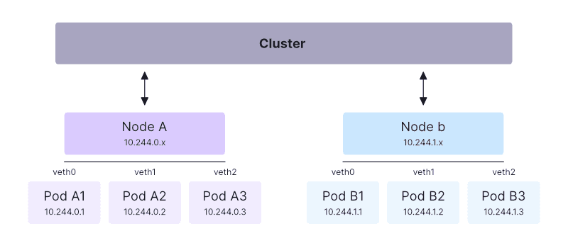

# Kubernetes Networking

Kubernetes networking allows the different components of a Kubernetes cluster—such as Nodes, Pods, Services, and external traffic—to communicate with each other. For the most part, Kubernetes networking is seamless, with traffic automatically routed across Nodes to reach your resources.

However, understanding how Kubernetes networking works is important for configuring your environment and setting up more complex networking scenarios. In this article, we’ll cover the different components of the Kubernetes networking architecture, how it differs from traditional networking solutions, and how Kubernetes handles various communication types within the cluster.

## What is Kubernetes Networking?

Kubernetes networking is the mechanism that enables different resources within and outside your cluster to communicate. Key scenarios include communication between Pods, between Services, and handling external traffic to the cluster.

Because Kubernetes is a distributed system, the network plane spans your cluster’s physical Nodes. Kubernetes uses a virtual overlay network that provides a flat network structure for your cluster resources to connect to.

Here’s an example of a Kubernetes networking diagram:

  

Kubernetes automatically allocates IP addresses, assigns DNS names, and maps ports to your Pods and Services. This process is generally automatic—you don’t need to manually configure these tasks on your network infrastructure or Node hosts.

At a high level, Kubernetes allocates each Pod a unique IP address that resolves within the cluster. Pods communicate using these IP addresses without requiring Network Address Translation (NAT) or additional configurations. This basic architecture is enhanced by the **Service** model, which allows traffic routing to any one of a set of Pods and provides methods like **network policies** to control Pod-to-Pod communication.

## Physical/VM Networking vs. Kubernetes Networking

Kubernetes networking simplifies and automates the tasks typically associated with networking physical devices and virtual machines (VMs). In traditional networking, you manually configure IP addresses, firewall rules, and DNS routes for new endpoints. In Kubernetes, these tasks are handled automatically within the cluster.

Kubernetes abstracts away the complexities, allowing developers and operators to deploy resources without needing detailed knowledge of the underlying network implementation. This simplifies the process of setting up, maintaining, and enforcing security across workloads, as all management occurs through Kubernetes itself.

## Docker Networking vs. Kubernetes Networking

Kubernetes and Docker differ significantly in their networking models due to their use cases:

- **Kubernetes** uses a flat networking model designed for distributed systems. All Pods can communicate with each other, regardless of the Node they’re running on.
  
- **Docker**, a single-host containerization solution, defaults to a bridge network that connects containers to the host. Docker also offers several network modes: `bridge`, `host`, and `overlay` (used in Docker Swarm).

In Docker, containers must be manually mapped to host ports, and you control container-to-container communication by placing them on separate networks. In Kubernetes, all Pods are part of the same overlay network, and you control traffic through **Network Policies**.

## Kubernetes Networking Architecture

Kubernetes networking has a flat structure with the following characteristics:

- Each Pod is assigned its own IP address.
- Nodes run a root network namespace that bridges the Pod interfaces, allowing all Pods to communicate using their IP addresses, regardless of the Node they’re on.
- Communication does not rely on NAT, reducing complexity and improving portability.
- Pods are assigned individual network namespaces and interfaces. All communications with Pods go through their assigned interfaces.
- The cluster-level network layer maps Node-level namespaces, allowing traffic to be correctly routed across Nodes.
- Manually binding Pod ports to Nodes is possible (using `hostPort`), but it’s not required in most cases.

These characteristics make Kubernetes networking predictable and consistent, ensuring Pods can access network connectivity without manual configuration.

### Pod IP Address Allocation

Kubernetes allocates IP addresses to Pods using **Classless Inter-Domain Routing (CIDR)**. The CIDR range defines the subnet of IP addresses available for Pods. You specify this range when configuring a new cluster’s networking layer.

Many Kubernetes networking plugins support **IP Address Management (IPAM)**, which allows you to manually assign IP addresses, prefixes, and pools. This facilitates advanced IP address management in more complex networking setups.

## DNS in Kubernetes Clusters

Kubernetes clusters include built-in DNS support, typically using **CoreDNS**, which is enabled by default in many Kubernetes distributions. Kubernetes assigns DNS names to Pods and Services in the following format:

- **Pod**: `pod-ip-address.pod-namespace-name.pod.cluster-domain.example` (e.g., `10.244.0.1.my-app.svc.cluster.local`)
- **Service**: `service-name.service-namespace-name.svc.cluster-domain.example` (e.g., `database.my-app.svc.cluster.local`)

Applications running in Pods should use DNS names to communicate with Services because Service IP addresses can change if the Service is deleted and recreated, while DNS names remain predictable.

## Network Isolation with Network Policies

By default, Kubernetes allows all Pods to communicate with each other. However, this can pose security risks, especially in multi-tenant clusters or environments with multiple applications. 

Kubernetes **Network Policies** let you control Pod communication by defining the allowed ingress and egress routes. These policies enable fine-grained control over traffic flows within the cluster, enhancing security.

## How Kubernetes Networking is Implemented

Kubernetes defines the required networking functionality but does not include a built-in implementation. Networking is provided by **Container Network Interface (CNI)** plugins, which you must install when setting up a cluster using tools like `kubeadm`.

The CNI model improves modularity in Kubernetes, allowing different plugins to offer unique features while adhering to the core Kubernetes networking requirements. Some popular CNI plugins include:

- **Calico**
- **Flannel**
- **Weave**
- **Cilium**

These plugins provide Kubernetes networking features and can integrate with external network technologies and services.

## Key Points

- Kubernetes uses a flat overlay network where all Pods automatically join, enabling communication via auto-assigned in-cluster IP addresses and DNS names.
- Pods that need to provide network services should be exposed using a **Kubernetes Service**, which offers a stable IP address and DNS name for routing traffic.
- **Network Policies** allow you to secure traffic flows within the cluster.
- Kubernetes relies on **CNI plugins** to implement networking, providing flexibility and modularity across different environments.

In this article, we’ve covered the fundamentals of Kubernetes networking, including its architecture, implementation, and key features. With this knowledge, you can better understand the networking processes in your cluster and how to configure them for different scenarios.

Looking to enforce policies and guardrails in your Kubernetes environment? Check out **Spacelift**, our CI/CD-driven infrastructure-as-code management platform with support for Kubernetes environments. Spacelift helps you apply policies, approval flows, and rules to prevent misconfigurations, ensuring your Kubernetes Pods are network-isolated with Network Policies.
