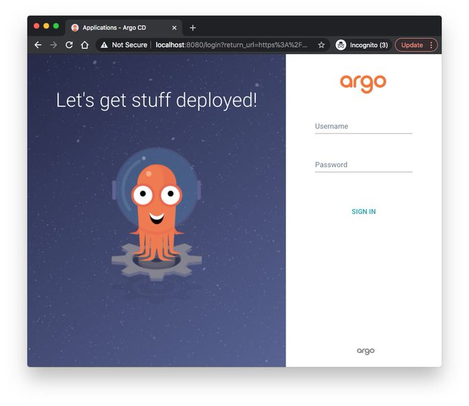

# What is Argo CD?

Argo CD is a GitOps-based Continuous Delivery (CD) tool that simplifies the deployment of applications on Kubernetes. It uses Git as the single source of truth to pull code and configurations into Kubernetes, automating the entire delivery pipeline.

## Challenges with Traditional CD in Kubernetes

1. **Tool Complexity**: You need tools like `kubectl` and Helm, adding extra operational work.
2. **Access Control Headaches**: Managing Kubernetes credentials across clusters is time-consuming and increases security risks.
3. **Scaling Woes**: As clusters grow, so does the need to reconfigure credentials for every team and application.
4. **Limited Visibility**: Traditional CD tools lose sight of deployments after configuration is applied, making it hard to spot issues until they break something.

## GitOps!

GitOps flips the script by using a **pull-based deployment model**. Instead of pushing code into the cluster, Argo CD **pulls** the latest updates from Git into Kubernetes, automatically syncing and deploying them. It’s more secure, more scalable, and easier to manage.

## How Argo CD Works

Unlike traditional CD tools like Jenkins, which sit outside the Kubernetes cluster, Argo CD operates inside the cluster. It continuously monitors your Git repository for changes, pulling updates and syncing them directly with your Kubernetes environment.

Any drift? Argo CD spots it and auto-corrects to match the Git configuration.

## Why Use Argo CD?

1. **Enhanced Security**: Cluster credentials stay inside, reducing exposure.
2. **Easy Scaling**: Argo CD effortlessly handles multiple clusters and teams.
3. **Real-Time Visibility**: See deployment status in real-time with continuous syncing and monitoring.

Git serves as the single source of truth, ensuring consistency across environments.

## Pull vs. Push

Instead of manually pushing changes, Argo CD pulls verified updates from Git, reducing operational burden and improving security. It keeps the cluster in sync at all times, ensuring what’s running matches what’s committed.

  

