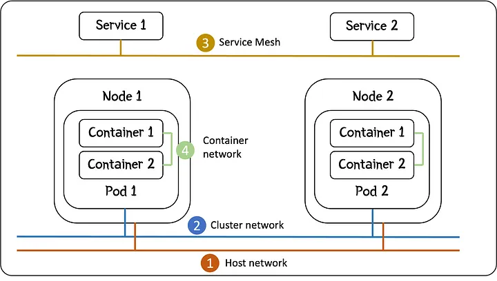

# Service Mesh and CNI

  

## Kubernetes Networks

It is first important to understand that there are four networks in a Kubernetes cluster:

1. **Host network**

This is the network that connects all the hosts that are running as Kubernetes Nodes. IP addresses allocated within this network are defined within your Virtual Private Cloud (VPC).

2. **Cluster network**

This is the network that seamlessly connects all the Pods together. Kubernetes requires that all Pods can talk to one another without any Network Address Transaction (NAT).

Effectively this makes Pods work like they are virtual machines sitting on a virtual network. The virtual network is a subnet shared amongst all Pods.

3. **Service Network**

Pods are ephemeral. This means that, at any moment, A Pod may be terminated and be rescheduled on the same or different Node. Even if it is on the same Node, it may be given a different IP address. Additional Pods may also be scheduled.

Because of this, Kubernetes introduces the idea of a Service. A Service is persistent and allows a client to access the Service even though the underlying Pods that provide the Service may change.

For this reason, each Service is given an IP address from the Service Network when it is created.

4. **Container network**

When you have multiple containers in a Pod, they share the same network. They can be thought of as processes running in a virtual machine, which is the Pod. This means they all have access to the same, Pod IP address.

Like all processes running in a host, they can talk to each other via the localhost loopback network. As they share the same IP address, they must operate on different ports.

## Container Network Interface (CNI)

Kubernetes requires that all of its Pods can talk to each other over the Cluster network. This requires each Node that is added to the cluster and each Pod that is scheduled, must be configured to implement the cluster subnet.

This is where the Container Network Interface (CNI) comes in.

When you install Kubernetes on a Node, you install a small application called kubelet. This acts as an Kubernetes agent on the Node, doing whatever it is told by the Kubernetes controller, including scheduling Pods.

When kubelet schedules a Pod, it need to set up the networking including it’s IP address. It does this by calling the CNI, which then assigns an IP address and configures the network interfaces within the Pod to ensure there is the connectivity that Kubernetes requires.

The CNI is an interface. The implementation of the interface is provided as a ‘plugin’ to Kubernetes. You will see this called a CNI plugin.

There are a number of CNI plugins, including Flannel and Calico. They implement the CNI in different ways within the Pod. They also provide different layers of security within the cluster.

## Service Mesh

A Service Mesh is a layer that sits on the Cluster Network. Instead of providing open access to any Pod from any Pod, it is designed to secure the communications between specific Pods.

A Service Mesh operates as a sidecar to each main application container. As such, it provides network connectivity to your main application container as a network proxy. The connection between the proxy and the main application is by way of the localhost network.

## Do I need a Service Mesh and a CNI Plugin?

A CNI is require by kubernetes to work, but a Service Mesh its not. But is really nice to have.

### Need for CNI plugin

Kubernetes requires that you implement the CNI interface so that it has connectivity between the Pods over the cluster network. It is a mandatory requirement.

### Need for Service Mesh

The Service Mesh runs on top of the cluster network and is optional.

The benefits of running a Service Mesh are:

- Security … the Service Mesh can implement routing rules as well as mutual Transport Layer Security (mTLS) between Pods
- Load balancing … define the distribution of traffic between Pods
- Monitoring … provide metrics and logs on connections and traffic
- Separation of concerns … allows network management to be abstracted from the application, making implementation consistent and technology agnostic for the application, including separation by namespace
- Reliability … requests that fail can be retried automatically

All these benefits make for a convincing reason for implementing a Service Mesh on top of the CNI plugin.

### Options for Service Mesh

There are several technologies for the Service Mesh, including:

    Istio
    Linkerd
    Cilium
    Consul Connect
    Cloud specific solutions, eg: GCP Anthos, AWS App Mesh, Azure Open Service Mesh (deprecated)

Many of these are now charging for the service. Istio is still a free open-source solution but can be complicated to set up and debug.

**Bibliography**:
- https://medium.com/@martin.hodges/why-do-i-need-a-service-mesh-as-well-as-a-cni-829b492398b7