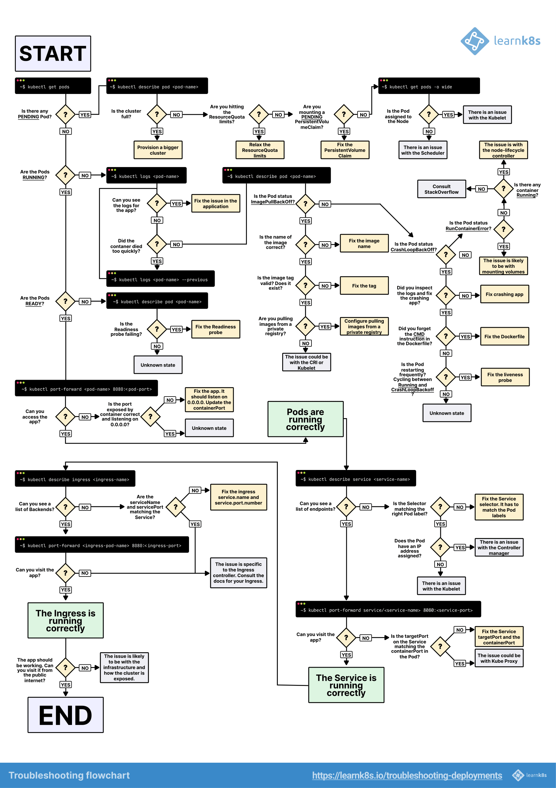

# Troubleshooting Deployments



A visual guide on troubleshooting Kubernetes deployments

When you wish to deploy an application in Kubernetes, you usually define three components:

    - A Deployment — a recipe for creating copies of your application.
    - A Service — an internal load balancer that routes the traffic to Pods.
    - An Ingress — a description of how the traffic should flow from outside the cluster to your Service.

Here's a quick recap.

In Kubernetes, your applications are exposed through two layers of load balancers: internal and external.
- The internal load balancer is called Service, whereas the external one is called Ingress.
- Pods are not deployed directly. Instead, the Deployment creates the Pods and watches over them.

Assuming you wish to deploy a simple Hello World application, the YAML for such an application should look similar to this:

```
hello-world.yaml

apiVersion: apps/v1
kind: Deployment
metadata:
  name: my-deployment
  labels:
    track: canary
spec:
  selector:
    matchLabels:
      any-name: my-app
  template:
    metadata:
      labels:
        any-name: my-app
    spec:
      containers:
        - name: cont1
          image: ghcr.io/learnk8s/app:1.0.0
          ports:
            - containerPort: 8080
---
apiVersion: v1
kind: Service
metadata:
  name: my-service
spec:
  ports:
    - port: 80
      targetPort: 8080
  selector:
    name: app
---
apiVersion: networking.k8s.io/v1
kind: Ingress
metadata:
  name: my-ingress
spec:
  rules:
  - http:
      paths:
      - backend:
          service:
            name: my-service
            port:
              number: 80
        path: /
        pathType: Prefix
```

The definition is quite long, and it's easy to overlook how the components relate.

For example:

    - When should you use port 80, and when port 8080?
    - Should you create a new port for every Service so that they don't clash?
    - Do label names matter? Should it be the same everywhere?

Before focusing on the debugging, let's recap how the three components link to each other.

Let's start with Deployment and Service.
Connecting Deployment and Service

The surprising news is that Service and Deployment aren't connected at all.

Instead, the Service directly points to the Pods and skips the Deployment.

You should pay attention to how the Pods and the Services are related to each other.

You should remember three things:

    The Service selector should match at least one Pod's label.
    The Service's targetPort should match the containerPort of the Pod.
    The Service port can be any number. Multiple Services can use the same port because different IP addresses are assigned.

The following diagram summarises how to connect the ports:

    Consider the following Pod exposed by a Service.
    1/5

    Consider the following Pod exposed by a Service.
    Next 

If you look at the YAML, the labels and ports/targetPort should match:

hello-world.yaml

apiVersion: apps/v1
kind: Deployment
metadata:
  name: my-deployment
  labels:
    track: canary
spec:
  selector:
    matchLabels:
      any-name: my-app
  template:
    metadata:
      labels:
        any-name: my-app
    spec:
      containers:
        - name: cont1
          image: ghcr.io/learnk8s/app:1.0.0
          ports:
            - containerPort: 8080
---
apiVersion: v1
kind: Service
metadata:
  name: my-service
spec:
  ports:
    - port: 80
      targetPort: 8080
  selector:
    any-name: my-app

What about the track: canary label at the top of the Deployment?

Should that match too?

That label belongs to the deployment, and it's not used by the Service's selector to route traffic.

In other words, you can safely remove it or assign it a different value.

And what about the matchLabels selector?

It always has to match the Pod's labels, and the Deployment uses it to track the Pods.

Assuming that you made the correct change, how do you test it?

You can check if the Pods have the correct label with the following command:

bash

kubectl get pods --show-labels
NAME                  READY   STATUS    LABELS
my-deployment-pv6pd   1/1     Running   any-name=my-app,pod-template-hash=7d6979fb54
my-deployment-f36rt   1/1     Running   any-name=my-app,pod-template-hash=7d6979fb54

Or if you have Pods belonging to several applications:

bash

kubectl get pods --selector any-name=my-app --show-labels

Where any-name=my-app is the label any-name: my-app.

Still having issues?

You can also connect to the Pod!

You can use the port-forward command in kubectl to connect to the Service and test the connection.

bash

kubectl port-forward service/<service name> 3000:80
Forwarding from 127.0.0.1:3000 -> 8080
Forwarding from [::1]:3000 -> 8080

Where:

    service/<service name> is the name of the service — in the current YAML is "my-service".
    3000 is the port that you wish to open on your computer.
    80 is the port the Service exposes in the port field.

If you can connect, the setup is correct.

If you can't, you most likely misplaced a label, or the port doesn't match.
Connecting Service and Ingress

The next step in exposing your app is to configure the Ingress.

The Ingress must know how to retrieve the Service to connect the Pods and route traffic.

The Ingress retrieves the correct Service by name and port exposed.

Two things should match in the Ingress and Service:

    The service.port of the Ingress should match the port of the Service
    The service.name of the Ingress should match the name of the Service

The following diagram summarises how to connect the ports:

    You already know that the Service exposes a port.
    1/4

    You already know that the Service exposes a port.
    Next 

In practice, you should look at these lines:

hello-world.yaml

apiVersion: v1
kind: Service
metadata:
  name: my-service
spec:
  ports:
    - port: 80
      targetPort: 8080
  selector:
    any-name: my-app
---
apiVersion: networking.k8s.io/v1
kind: Ingress
metadata:
  name: my-ingress
spec:
  rules:
  - http:
      paths:
      - backend:
          service:
            name: my-service
            port:
              number: 80
        path: /
        pathType: Prefix

How do you test that the Ingress works?

You can use the same strategy as before with kubectl port-forward, but instead of connecting to a Service, you should connect to the Ingress controller.

First, retrieve the Pod name for the Ingress controller with:

bash

kubectl get pods --all-namespaces
NAMESPACE   NAME                              READY STATUS
kube-system coredns-5644d7b6d9-jn7cq          1/1   Running
kube-system etcd-minikube                     1/1   Running
kube-system kube-apiserver-minikube           1/1   Running
kube-system kube-controller-manager-minikube  1/1   Running
kube-system kube-proxy-zvf2h                  1/1   Running
kube-system kube-scheduler-minikube           1/1   Running
kube-system nginx-ingress-controller-6fc5bcc  1/1   Running

Identify the Ingress Pod (which might be in a different Namespace) and describe it to retrieve the port:

bash

kubectl describe pod nginx-ingress-controller-6fc5bcc \
 --namespace kube-system \
 | grep Ports
Ports:         80/TCP, 443/TCP, 18080/TCP

Finally, connect to the Pod:

bash

kubectl port-forward nginx-ingress-controller-6fc5bcc 3000:80 --namespace kube-system
Forwarding from 127.0.0.1:3000 -> 80
Forwarding from [::1]:3000 -> 80

At this point, every time you visit port 3000 on your computer, the request is forwarded to port 80 on the Ingress controller Pod.

If you visit http://localhost:3000, you should find the app serving a web page.
Recap on ports

Here's a quick recap on what ports and labels should match:

    The Service selector should match the label of the Pod
    The Service targetPort should match the containerPort of the container inside the Pod
    The Service port can be any number. Multiple Services can use the same port because different IP addresses are assigned.
    The service.port of the Ingress should match the port in the Service
    The name of the Service should match the field service.name in the Ingress

Knowing how to structure your YAML definition is only part of the story.

What happens when something goes wrong?

Perhaps the Pod doesn't start, or it's crashing.
3 steps to troubleshoot Kubernetes deployments

It's essential to have a well-defined mental model of how Kubernetes works before debugging a broken deployment.

Since every deployment has three components, you should debug all of them in order, starting from the bottom.

    You should make sure that your Pods are running, then
    Focus on getting the Service to route traffic to the Pods and then
    Check that the Ingress is correctly configured.

    You should start troubleshooting your deployments from the bottom. First, check that the Pod is Ready and Running.
    1/3

    You should start troubleshooting your deployments from the bottom. First, check that the Pod is Ready and Running.
    Next 

1. Troubleshooting Pods

Most of the time, the issue is in the Pod itself.

You should ensure your Pods are Running and Ready.

How do you check that?

bash

kubectl get pods
NAME                    READY STATUS            RESTARTS  AGE
app1                    0/1   ImagePullBackOff  0         47h
app2                    0/1   Error             0         47h
app3-76f9fcd46b-xbv4k   1/1   Running           1         47h

In the output above, the last Pod is Running and Ready — however, the first two Pods are neither Running nor Ready.

How do you investigate what went wrong?

There are four valuable commands to troubleshoot Pods:

    kubectl logs <pod name> helps retrieve the logs of the containers of the Pod.
    kubectl describe pod <pod name> is helpful to retrieve a list of events associated with the Pod.
    kubectl get pod <pod name> helps extract the YAML definition of the Pod as stored in Kubernetes.
    kubectl exec -ti <pod name> -- bash is helpful to run an interactive command within one of the containers of the Pod.

Which one should you use?

There isn't a one-size-fits-all.

Instead, you should use a combination of them.
Common Pods errors

Pods can have startup and runtime errors.

Startup errors include:

    ImagePullBackoff
    ImageInspectError
    ErrImagePull
    ErrImageNeverPull
    RegistryUnavailable
    InvalidImageName

Runtime errors include:

    CrashLoopBackOff
    RunContainerError
    KillContainerError
    VerifyNonRootError
    RunInitContainerError
    CreatePodSandboxError
    ConfigPodSandboxError
    KillPodSandboxError
    SetupNetworkError
    TeardownNetworkError

Some errors are more common than others.

The following is a list of the most common errors and how you can fix them.
ImagePullBackOff

This error appears when Kubernetes is unable to retrieve the image for one of the pod's containers.

There are three common culprits:

    The image name is invalid—for example, you misspelt the name, or the image does not exist.
    You specified a non-existing tag for the image.
    The image you're trying to retrieve belongs to a private registry, and Kubernetes doesn't have credentials to access it.

Correcting the image name and tag can solve the first two cases.

Lastly, you should add the credentials to your private registry in a Secret and reference them in your Pods.

The official documentation has an example of how you could do that.
CrashLoopBackOff

If the container can't start, Kubernetes shows the CrashLoopBackOff message as a status.

Usually, a container can't start when:

    There's an error in the application that prevents it from starting.
    You misconfigured the container.
    The Liveness probe failed too many times.

You should retrieve the logs from that container to investigate why it failed.

If you can't see the logs because your container is restarting too quickly, you can use the following command:

bash

kubectl logs <pod-name> --previous

Which prints the error messages from the previous container.
RunContainerError

The error appears when the container is unable to start.

That's even before the application inside the container starts.

The issue is usually due to misconfiguration, such as:

    Mounting a non-existent volume such as ConfigMap or Secrets.
    Mounting a read-only volume as read-write.

You should use kubectl describe pod <pod-name> to inspect and analyse the errors.
Pods in a Pending state

When you create a Pod, the Pod stays in the Pending state.

Why?

Assuming that your scheduler component is running fine, here are the causes:

    The cluster doesn't have enough resources, such as CPU and memory, to run the Pod.
    The current Namespace has a ResourceQuota object, and creating the Pod will increase the Namespace's quota.
    The Pod is bound to a Pending PersistentVolumeClaim.

Your best option is to inspect the Events section in the kubectl describe command:

bash

kubectl describe pod <pod name>

For errors that are created as a result of ResourceQuotas, you can inspect the logs of the cluster with the following:

bash

kubectl get events --sort-by=.metadata.creationTimestamp

Pods in a not Ready state

If a Pod is Running but not Ready, the Readiness probe is failing.

When the Readiness probe fails, the Pod isn't attached to the Service, and no traffic is forwarded to that instance.

A failing Readiness probe is an application-specific error, so you should inspect the Events section in kubectl describe to identify the error.
2. Troubleshooting Services

If your Pods are Running and Ready, but still cannot receive a response from your app, you should check if the Service is configured correctly.

Services are designed to route the traffic to Pods based on their labels.

So the first thing you should check is how many Pods the Service targets.

You can do so by checking the Endpoints in the Service:

bash

kubectl describe service my-service
Name:                     my-service
Namespace:                default
Selector:                 app=my-app
IP:                       10.100.194.137
Port:                     <unset>  80/TCP
TargetPort:               8080/TCP
Endpoints:                172.17.0.5:8080

An endpoint is a pair of <ip address:port>, and there should be at least one — when the Service targets (at least) a Pod.

If the "Endpoints" section is empty, there are two explanations:

    You don't have any Pod running with the correct label (hint: you should check if you are in the correct namespace).
    You have a typo in the selector labels of the Service.

If you see a list of endpoints but still can't access your application, the targetPort in your service is likely the culprit.

How do you test the Service?

Regardless of the type of Service, you can use kubectl port-forward to connect to it:

bash

kubectl port-forward service/<service-name> 3000:80

Where:

    <service-name> is the name of the Service.
    3000 is the port you wish to open on your computer.
    80 is the port exposed by the Service.

3. Troubleshooting Ingress

If you've reached this section, then:

    The Pods are Running and Ready.
    The Service distributes the traffic to the Pod.

But you still can't see a response from your app.

This means that the Ingress is most likely misconfigured.

Since the Ingress controller is a third-party component in the cluster, there are different debugging techniques depending on the type of Ingress controller.

But before diving into Ingress-specific tools, there's something straightforward that you can check.

The Ingress uses the service.name and service.port to connect to the Service.

You should check that those are correctly configured.

You can inspect that the Ingress is correctly configured with:

bash

kubectl describe ingress my-ingress
Name:             my-ingress
Namespace:        default
Rules:
  Host        Path  Backends
  ----        ----  --------
  *
              /   my-service:80 (<error: endpoints "my-service" not found>)

If the Backend column is empty, the configuration must have an error.

If you can see the endpoints in the Backend column but still can't access the application, the issue is likely to be:

    How you exposed your Ingress to the public internet.
    How you exposed your cluster to the public internet.

You can isolate infrastructure issues from Ingress by directly connecting to the Ingress Pod.

First, retrieve the Pod for your Ingress controller (which could be located in a different namespace):

bash

kubectl get pods --all-namespaces
NAMESPACE   NAME                              READY STATUS
kube-system coredns-5644d7b6d9-jn7cq          1/1   Running
kube-system etcd-minikube                     1/1   Running
kube-system kube-apiserver-minikube           1/1   Running
kube-system kube-controller-manager-minikube  1/1   Running
kube-system kube-proxy-zvf2h                  1/1   Running
kube-system kube-scheduler-minikube           1/1   Running
kube-system nginx-ingress-controller-6fc5bcc  1/1   Running

Describe it to retrieve the port:

bash

kubectl describe pod nginx-ingress-controller-6fc5bcc
 --namespace kube-system \
 | grep Ports
    Ports:         80/TCP, 443/TCP, 8443/TCP
    Host Ports:    80/TCP, 443/TCP, 0/TCP

Finally, connect to the Pod:

bash

kubectl port-forward nginx-ingress-controller-6fc5bcc 3000:80 --namespace kube-system
Forwarding from 127.0.0.1:3000 -> 80
Forwarding from [::1]:3000 -> 80

At this point, every time you visit port 3000 on your computer, the request is forwarded to port 80 on the Pod.

Does it work now?

    If it does, the issue is in the infrastructure. You should investigate how the traffic is routed to your cluster.
    If it doesn't work, the problem is in the Ingress controller. You should debug it.

If you still can't get the Ingress controller to work, you should start debugging it.

There are many different versions of Ingress controllers.

Popular options include Nginx, HAProxy, Traefik, etc.

You should consult the documentation of your Ingress controller to find a troubleshooting guide.

Since Ingress Nginx is the most popular Ingress controller, we included a few tips for it in the next section.
Debugging Ingress Nginx

The Ingress-nginx project has an official plugin for Kubectl.

You can use kubectl ingress-nginx to:

    Inspect logs, backends, certs, etc.
    Connect to the Ingress.
    Examine the current configuration.

The three commands that you should try are:

    kubectl ingress-nginx lint, which checks the nginx.conf.
    kubectl ingress-nginx backend to inspect the backend (similar to kubectl describe ingress <ingress-name>).
    kubectl ingress-nginx logs is used to check the logs.

    Please notice that you might need to specify the correct namespace for your Ingress controller with --namespace <name>.

Summary

Troubleshooting in Kubernetes can be daunting if you don't know where to start.

You should always remember to approach the problem from the bottom up: start with the Pods and move up the stack with Service and Ingress.

The same debugging techniques that you learnt in this article can be applied to other objects, such as:

    Failing Jobs and CronJobs.
    StatefulSets and DaemonSets.

Many thanks to Gergely Risko, Daniel Weibel and Charles Christyraj for offering some invaluable suggestions.

**Obtained from**: https://learnk8s.io/troubleshooting-deployments


