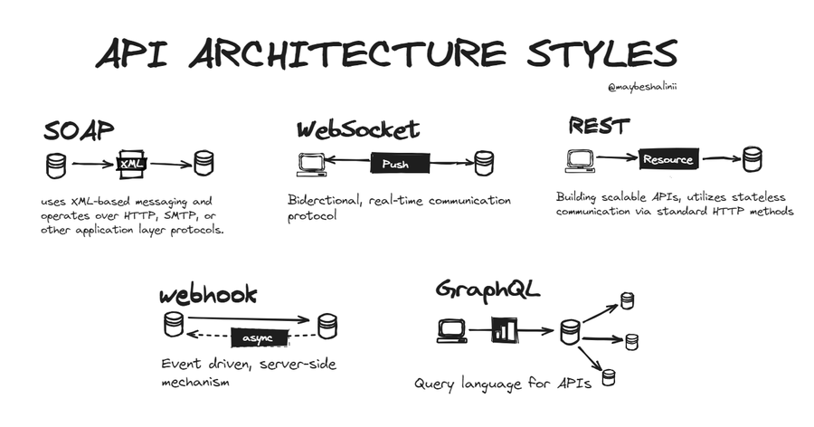

# API Architecture Styles

  

### SOAP (Simple Object Access Protocol)

SOAP is an architectural style for designing web services. 
It relies on XML-based messaging to facilitate communication between different systems over the internet. 
SOAP uses a set of predefined rules and standards to structure messages, and it can operate over various protocols. 
The key idea is to enable the exchange of structured information in a platform-independent manner, allowing diverse applications to interact seamlessly. The use of XML ensures a standardized format for data exchange, promoting interoperability among different software applications.

### REST (Representational State Transfer) API Architecture

REST is a design approach for web services that emphasizes simplicity, scalability, and statelessness. 
In a RESTful API, resources (such as data objects or services) are identified by unique URIs, and interactions with these resources are performed using standard HTTP methods. 
RESTful APIs use a stateless client-server communication model, meaning each request from a client contains all the information needed for the server to fulfill that request, without relying on stored client state. This architectural style promotes flexibility, making it easier to evolve and scale applications over time.

### Webhook API Architecture

A webhook is a communication method where a server sends real-time data to a specified endpoint (URL) as soon as an event occurs. Unlike traditional APIs where you have to request information actively, webhooks enable a "push" mechanism, allowing servers to instantly notify and share data with other systems or applications when relevant events happen. 
This helps in achieving efficient and timely updates between different services, making it particularly useful for applications requiring quick, event-driven communication.

### WebSocket

WebSocket is a communication protocol that enables real-time, bidirectional data exchange between a client (like a web browser) and a server over a single, long-lived connection.  
Unlike traditional request-response interactions in HTTP, WebSocket allows both the client and server to initiate communication independently, facilitating low-latency and efficient data transfer for applications that require constant updates, such as live chats or real-time gaming.  
WebSocket maintains a persistent connection, enabling instant data transmission without the need for repeated requests, making it suitable for scenarios where timely and continuous updates are crucial.

### GraphQL

GraphQL is an API architectural style that allows clients to request only the specific data they need, avoiding over-fetching or under-fetching of information.  
In GraphQL, clients define the structure of the response, and the server provides exactly that data, enabling more efficient and flexible data retrieval compared to traditional REST APIs. GraphQL uses a single endpoint for queries and mutations, simplifying interactions and making it a powerful choice for applications requiring dynamic and customized data retrieval.

**Bibliography**:
- https://twitter.com/maybeshalinii/status/1836268999060959450