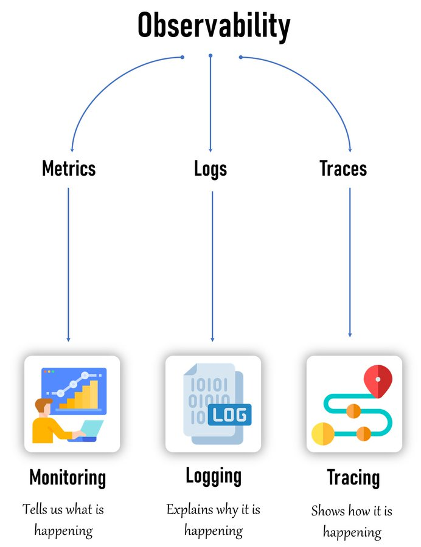

# What is Observability?

Observability is the ability to measure the internal state of a system by examining its outputs. It enables you to understand what is happening, why it’s happening, and how it’s happening within your application infrastructure.

### 1. Metrics
- Indicates what is happening in the system.
- Tracks performance indicators like CPU usage, memory usage, and request rates.
- Supports monitoring of system health and performance.

### 2. Logs
- Explains why something occurred.
- Captures detailed records of system events, errors, and other notable events.
- Facilitates troubleshooting and debugging.

### 3. Traces
- Illustrates how processes are happening.
- Tracks the flow of requests across services in distributed systems.
- Essential for tracing the journey of a transaction or request through multiple services.

**Metrics = Monitoring** | **Logs = Logging** | **Traces = Tracing**

  

