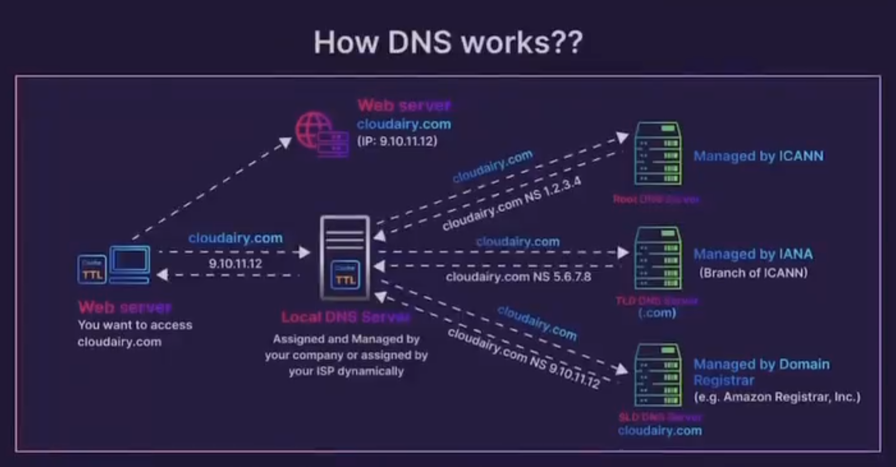

# How a DNS Works

DNS (Domain Name System) works like the internet's phonebook. When you type a website address (like www.example.com) into your browser, DNS translates that human-friendly name into an IP address (like 192.0.2.1), which is the actual "address" where the website is located on the internet.

## How it works step-by-step

1. You type a website address: You enter a domain name (e.g., www.example.com) in your browser.
2. DNS query is sent: Your device sends a request (called a DNS query) to find the IP address linked to that domain name.
3. Resolver checks cache: First, your computer (or internet service provider) checks if it already knows the IP address from recent visits. If it does, the process ends here.
4. Ask the DNS server: If the IP isn’t cached, the query goes to a DNS resolver server, which acts like a guide.
   - Resolver asks other DNS servers: The resolver contacts other DNS servers, such as:
   - Root servers: These know where to find the DNS servers for the next part of the domain (e.g., .com).
   - TLD servers: These direct the resolver to the servers responsible for domains ending in .com, .org, etc.
   - Authoritative name servers: These know the IP address of www.example.com.
6. Return the IP address: Once the authoritative server gives the IP address, the resolver sends it back to your device.
7. Website loads: Your browser uses that IP address to connect to the website’s server, and the website appears.

## Common DNS Record Types and Their Usage

DNS records are like entries in a directory, each serving a different purpose to help the DNS system route traffic properly. Here are the most common DNS record types and how they are used:

### 1. **A Record (Address Record)**
- **Purpose**: Maps a domain name to an IPv4 address (e.g., `192.0.2.1`).
- **Usage**: When you visit a website like `www.example.com`, the A record tells the DNS which IPv4 address the domain should resolve to.

    Example:
    ```
    www.example.com → 192.0.2.1
    ```

### 2. **AAAA Record (IPv6 Address Record)**
- **Purpose**: Maps a domain name to an IPv6 address (e.g., `2001:db8::ff00:42:8329`).
- **Usage**: Similar to A records but for newer IPv6 addresses instead of IPv4.

    Example:
    ```
    www.example.com → 2001:db8::ff00:42:8329
    ```

### 3. **CNAME Record (Canonical Name Record)**
- **Purpose**: Aliases one domain name to another.
- **Usage**: Often used for subdomains or to point different domain names to the same website. For example, `blog.example.com` can be a CNAME for `www.example.com`, meaning it will resolve to the same address.

    Example:
    ```
    blog.example.com → www.example.com
    ```

### 4. **MX Record (Mail Exchange Record)**
- **Purpose**: Directs email to the correct mail servers for a domain.
- **Usage**: Tells where to deliver email sent to a domain, such as for `user@example.com`. The MX record points to the mail server’s address.

    Example:
    ```
    example.com → mailserver.example.com (Priority: 10)
    ```

### 5. **NS Record (Name Server Record)**
- **Purpose**: Specifies the authoritative DNS servers for a domain.
- **Usage**: Tells which DNS servers are responsible for a domain's DNS queries. These servers hold the actual records for that domain.

    Example:
    ```
    example.com → ns1.nameserver.com
    ```

### 6. **TXT Record (Text Record)**
- **Purpose**: Stores text information related to the domain.
- **Usage**: Often used for verifying domain ownership (e.g., for Google services) and for security features like SPF, DKIM, and DMARC, which help authenticate email sources.

    Example:
    ```
    v=spf1 include:example.com ~all
    ```

### 7. **SRV Record (Service Record)**
- **Purpose**: Defines the location (hostname and port) of specific services (e.g., VoIP or instant messaging services).
- **Usage**: Used to direct traffic for specific services (like SIP, LDAP, etc.).

    Example:
    ```
    _sip._tcp.example.com → sipserver.example.com (Port: 5060)
    ```

### 8. **PTR Record (Pointer Record)**
- **Purpose**: Maps an IP address to a domain name (reverse of an A/AAAA record).
- **Usage**: Used for reverse DNS lookups, often for logging and verification. For example, checking what domain an IP address corresponds to.

    Example:
    ```
    192.0.2.1 → www.example.com
    ```

### 9. **SOA Record (Start of Authority Record)**
- **Purpose**: Provides information about the DNS zone, such as the primary name server and contact information.
- **Usage**: Contains administrative data for a domain’s zone file, including version number and refresh times.

    Example:
    ```
    example.com → ns1.example.com (Admin: hostmaster@example.com)
    ```

### 10. **CAA Record (Certification Authority Authorization)**
- **Purpose**: Specifies which Certificate Authorities (CAs) are allowed to issue SSL certificates for a domain.
- **Usage**: Helps enhance security by controlling which CAs can issue certificates, preventing unauthorized issuance.

    Example:
    ```
    example.com → 0 issue "letsencrypt.org"
    ```

### 11. **TTL (Time To Live)**
- **Purpose**: Not a record type but an important setting that tells how long a DNS record should be cached by resolvers.
- **Usage**: Controls how often DNS servers check for updates. A low TTL means records are updated frequently, while a high TTL means longer caching.

---

## Summary Table of DNS Records:

| **Record Type** | **Description**                                               |
| --------------- | ------------------------------------------------------------- |
| **A**           | Maps a domain to an IPv4 address.                             |
| **AAAA**        | Maps a domain to an IPv6 address.                             |
| **CNAME**       | Alias one domain to another.                                  |
| **MX**          | Routes email to mail servers.                                 |
| **NS**          | Specifies authoritative DNS servers for a domain.             |
| **TXT**         | Stores text for domain verification and email authentication. |
| **SRV**         | Defines service location (hostname and port).                 |
| **PTR**         | Maps an IP address to a domain (reverse lookup).              |
| **SOA**         | Provides administrative information for the domain.           |
| **CAA**         | Specifies allowed certificate authorities for the domain.     |

<p aling="center">
  
</p>

**Bibliography**:
- https://x.com/SecurityTrybe/status/1835371157211451618